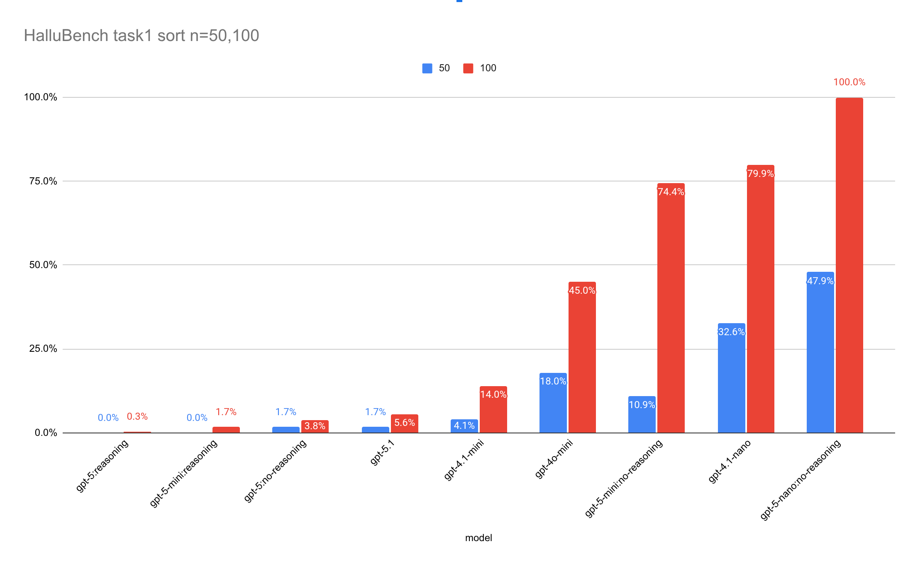

# HalluBench
Zero-Knowledge LLM Hallucination Rate Benchmark

## FAQ

* Q: What does zero-knowledge mean?
  * A: it dos not rely or measure how much knowledge the LLM know but it measures that when the LLM is presented with knowledge (in via RAG or in the prompt) will it be able to pick it?
* Q: How it's measured?
  * A: a value is considered Hallucination if:
    * if the value is present in the the actual output but not in expected output
    * or if the value is present in the expected output but not in the actual output (omission)
  * `Hallucination rate = 1.0 - (Out_true intersection Out_actual) / (Out_true union Out_actual)`
  * how many times it spit something that it shouldn't + how many times it did not spit something that it should have spit over the union

## How to run it

Copy the files in `examples/` directory into the current directory, rename `dotenv` into `.env`
and edit those files to setup your models and your api keys

```bash
cp examples/config.json config.json
cp examples/dotenv .env
```

then you can run

```bash
python3 eval_task_1_1.py
```

You might want to edit `from my_any_llm import completion` to be `from any_llm import completion`


## HalluBench Task 1-1 Sort

The LLM is given a CSV of N rows (50 by default) with sequential ids, UUIDv4, md5, date, datetime, score or signal
then asked to return them sorted them by the score/signal.
This is quite simple task specially that the column we used for sorting have small integer values.
We are just changing the order of rows of the input.
To make the task slightly challenging we removed small number of rows (by default ~5% that is 3 rows)
just to test weather the model is going to hallucinate those missing ids.



## HalluBench Task 1-2 Craft Columns

Similar to Task 1-1, but it goes like this

You will be given CSV with header.
Your task is to construct a CSV such that:

* Rename `update_timestamp` into `update_date` and remove time part of it, keeping date part only. Move this column to be just after `id` (deleting original `update_timestamp`).
* Add a column named `hex4_id` just after newly add `update_date` having 4 hexadecimal digits formed by using the rightmost 2 digits from `md5` followed by the rightmost 2 digits from `uuid`.
* Drop `date` and `uuid` columns
* make `md5` uppercase while keeping `hex4_id` lowercase.
* Keep other columns as-is and in same order.
* rows should be returned in reverse order.
* Give full CSV output, and direct answer only no explanation.


## HalluBench Task 2 Grouping

TBD
